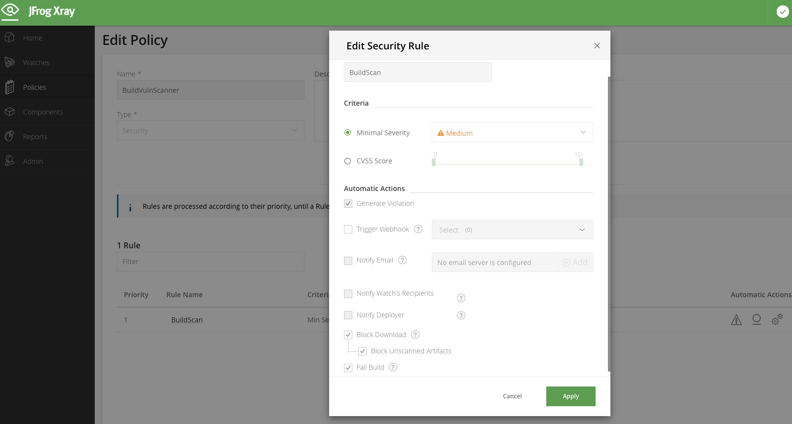

# jfrog-demo

## CCIによる以下の処理を実施する

1. リポジトリ上のDockerfileを用いたDockerイメージのビルド
1. JFrogの認証
1. Artifactoryにビルドを追加
1. イメージのスキャンと、パスした場合のプロモート

## 変数
- $jfqdn: CCIの環境変数に定義が必要/JFrog ArtifactoryのFQDN
- $user: CCIの環境変数に定義が必要/JFrog Artifactoryのユーザー名
- $password: CCIの環境変数に定義が必要/JFrog Artifactoryのパスワード
- $jid: CCIの環境変数に定義が必要/JFrog ArtifactoryのID 
- $CIRCLE_PROJECT_REPONAME: CCIで自動取得/CCIのプロジェクト名(Githubのリポ名)
- $CIRCLE_BUILD_NUM:CCIで自動取得/CCIのビルド番号

## 注意事項
Pushするビルドがスキャン対象となるようなPolicyとWatchを予めXRAY側で設定しておく必要がある。

XRAYの設定に基づき、ビルドの失敗、成功がジャッジされる

